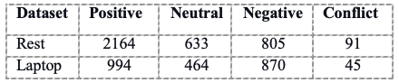

# NLP: Aspect Sentiment Classification (ASC)

## Project Description

Sentiment analysis is increasingly viewed as a vital task both from an academic and a commercial standpoint. The majority of existing evaluations in Sentiment Analysis (SA) are aimed at evaluating the overall polarity of a sentence, paragraph, or text span. In contrast, this task will provide evaluation for detecting aspects and the sentiment expressed towards each aspect.

This project aims to solve the Subtask 2 of SemEval 2014 Task 4 - Aspect Based Sentiment Analysis

Subtask 2: Aspect term polarity
Given one or more aspect terms within a sentence, determine whether the polarity of each aspect term is positive, negative, neutral or conflict (i.e., both positive and negative).

For example:
“I loved their fajitas” → {fajitas: positive}
“I hated their fajitas, but their salads were great” → {fajitas: negative, salads: positive}
“The fajitas are their first plate” → {fajitas: neutral}
“The fajitas were great to taste, but not to see” → {fajitas: conflict}

## Literature Review

A wide range of techniques has been proposed to perform aspect sentiment classification (ASC). The early approaches are usually based on manually designed features and use syntactic dependencies to link aspect term and opinion (C. Brun, 2014). In recent years, deep learning-based methods have attracted a lot of interests. For example, target-dependent LSTM and target-connection LSTM were proposed to model the interaction between the aspect and its preceding and following contexts to improve the accuracy of sentiment classification (D. Tang, 2016). Based on the intuition that different parts of the sentences contain different information regarding the aspect (Y. Wang, 2016), attention mechanisms are employed with LSTM, to achieve further improvement on accuracy. Binxuan Huang, 2018 introduced attention-over-attention (AOA) LSTM neural network which jointly learns the representations for aspects and sentences, and automatically focuses on the important parts in sentences. 

Apart from LSTM, other neuron network structures, including the CNN-based network, memory network and the gated network are also explored with attention mechanisms (Wenxuan Zhang, 2022).  Memory network can handle insufficient training samples issue and it greatly improved the performance (D. Tang, 2016). Performance also improves with graph convolutional neural network (Pinlong Zhaoa, 2019). According to the authors, their architecture performs particularly well when a sentence contains more than one aspect term. 

Pre-trained language models such as BERT are also fine-tuned for sentiment classification problem and achieved success (Emanuel H. Silva, 2021). For instance, a BERT-based model was proposed for a sentence pair classification problem which is converted from the original ASC task (C. Sun, 2019). A DeBERTa model (Decoding-enhanced BERT with Disentangled Attention) was also explored to disentangle the syntactic and semantics features from a BERT architecture (Emanuel H. Silva, 2021)

## Methodology 

We'll explore a pretrain model-based approach for ASC task, which takes advantages of the word embeddings from pretrain models. It is based on the understanding that pre-train models such as BERT was trained to embed not only the word sematics but also the context meaning. By delegating the understanding of the context, which contains the sentiment of target aspect terms, to pretrain models, we can focus on hyperparameter tunings and experiments on the format of input. 

## Data
The dataset used in this task is from Sem-Eval 2014 dataset, which contains training sets and testing sets for two specific domains “Laptop” and “Restaurant”. Since there are no polarity lables for aspect terms in the testing sets, we used only the training sets. To generate the training data and validation data for our models, we'll split the training sets with the train-valid ratio of 80:20. 

During our experiments, both domains are explored. The Table below describes the distribution of polarities for aspect terms in our datasets:

To evaluate the performance of our model, we'll use the overal “Accuracy”. The accuracy by polarities are also used to draw insights for future improvements.

## Model result:
A slight change to input format can lead to a slight change in the model performance. Different pretrain models such as BERT, XLNet and DistilBert gives similar results. The highest accuracy achieved is 72%.

# References
- SemEval 2014 Task 4 - Aspect Based Sentiment Analysis: https://www.aclweb.org/portal/content/semeval-2014-task-4-aspect-based-sentiment-analysis
- Binxuan Huang, Y. O. (2018). Aspect Level Sentiment Classification with Attention-over-Attention Neural Networks.
- C. Brun, D. N. (2014). XRCE: hybrid classification for aspect-based sentiment analysis. SemEval@COLING, 838–842.
- C. Sun, L. H. (2019). Utilizing BERT for aspect-based sentiment analysis via constructing auxiliary sentence. NAACL-HLT, 380–385.
- Cai, H. T. (2010). Aspect-category based sentiment analysis with hierarchical graph convolutional network. Proceedings of the 28th International Conference on Computational Linguistics , 833-843.
- D. Tang, B. Q. (2016). Effective lstms for target-dependent sentiment classification. COLING,, 3298–3307.
- Emanuel H. Silva, R. M. (2021). Aspect-based Sentiment Analysis using BERT with Disentangled Attention. 1.
- K. Schouten, F. F. (2016). Survey on aspect-level sentiment analysis. IEEE Trans. Knowl. Data Eng., 28(3), 813–830.
- Wenxuan Zhang, X. L. (2022). A Survey on Aspect-Based Sentiment Analysis: Tasks, Methods, and Challenges. 3-8.
- Y. Wang, M. H. (2016). Attentionbased LSTM for aspect-level sentiment classification. EMNLP, 606–615.

